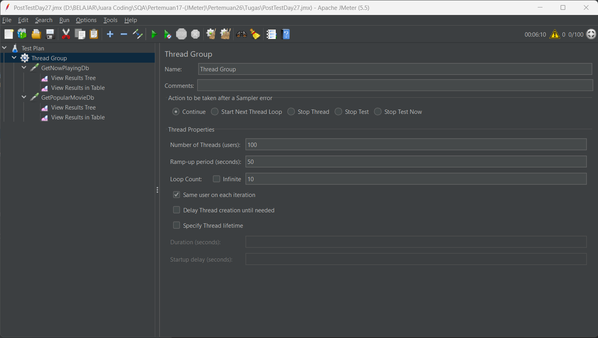
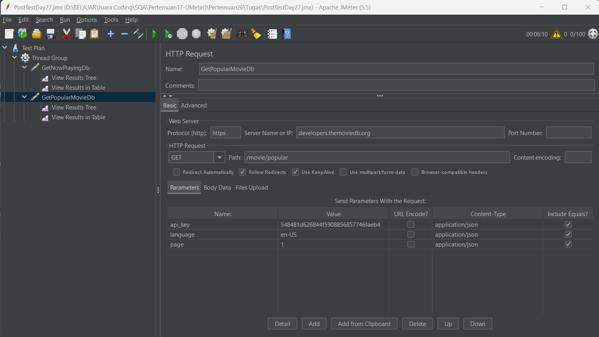
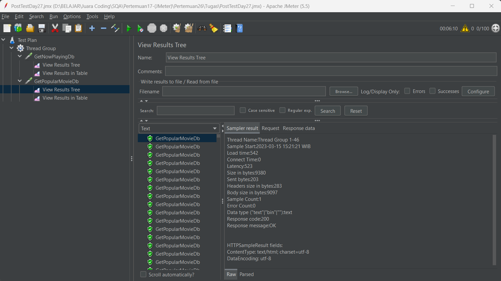
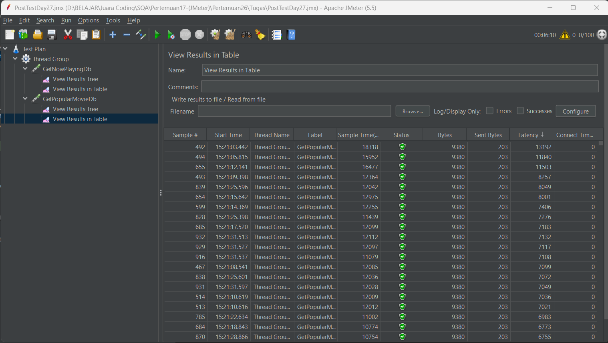
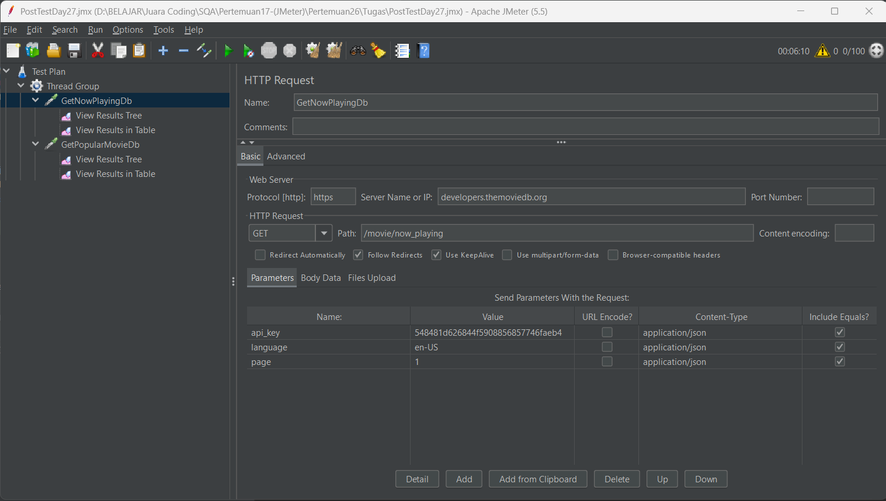
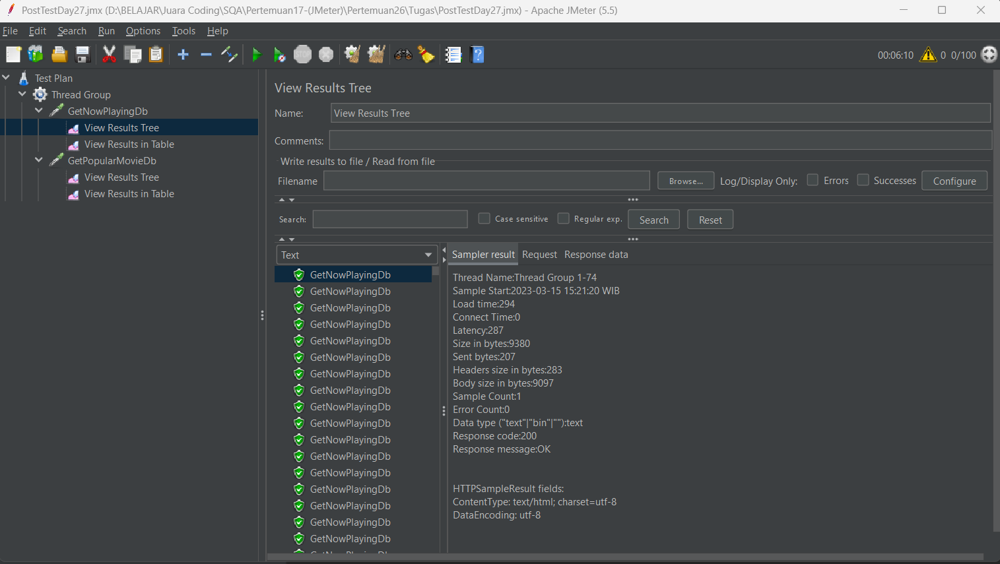
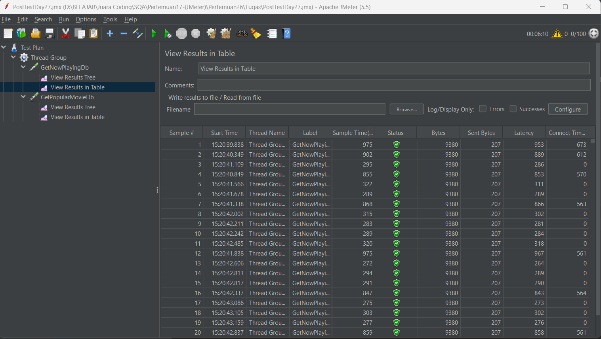

## POST TEST DAY 27
### Testing API Movie DB With JMeter
____________________________________________

Berikut Hasil Runnya

1. Thread Group
 Number of threads (User) : 100
 Ramp-up period : 50
 Loop Count : 10
    berikut screenshootnya
 
   

 

2. Get Popular Movie
       berikut screenshootnya
     Http Request
   
     
     View Result Tree
   
    
     View Result in Table
   

 
 

3. Get Now Playing Movie
       berikut screenshootnya
     Http Request
   
    
     View Result Tree
   
    
     View Result in Table
   
